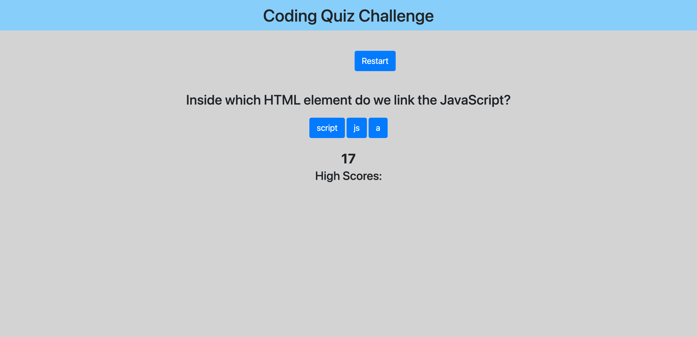
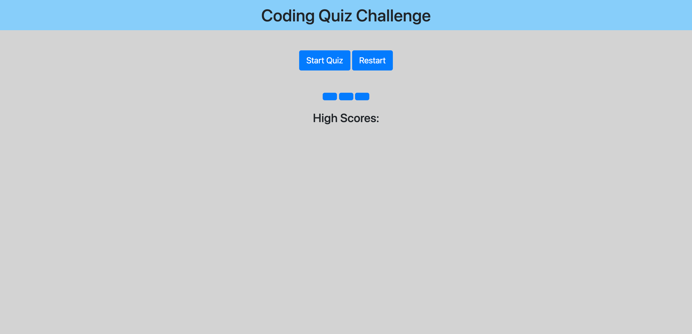

# quizApp

## Description

This is a Quiz application that will ask you a series of 3 questions about javascript programming.

To start the quiz you will click the start quiz button that will show you a question and 3 possible answers. A timer will start at 20 seconds and count down. if you get a question wrong you stay on the same question but 2 seconds will be subtracted from the timer. if you get the question right it will initialize the next question. if all 3 questions are answered correctly before the timer hits zero you will get a window prompt that asks for your intials and your score will be recorded below. if you hit the restart button the quiz will start over.

## Screenshot

## Links to Application

- Here is the link to the repo: [smarr2198/repo](https://github.com/smarr2198/quizApp)
- Here is the link to the pages: [smarr2198/pages](https://smarr2198.github.io/quizApp/)
